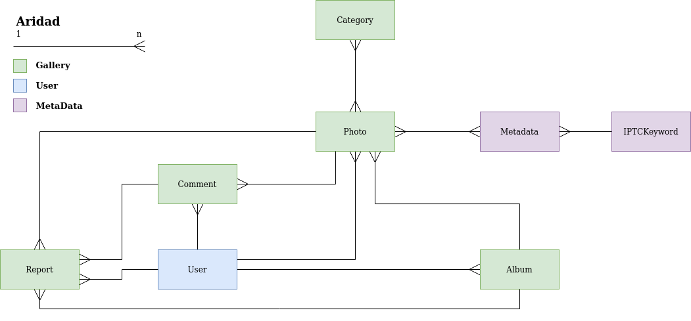
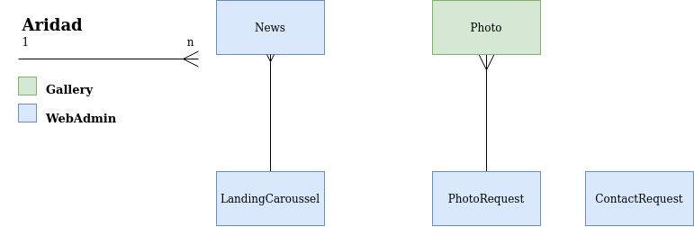

# Backend Memoria Fotográfica

## Dependencias
Este proyecto depende principalmente de las siguientes librerías:

- `Django x.x.x` como framework web (MVVM)
- `Django REST Framework (DRF)` para el desarrollo de la API Rest y los componentes involucrados:
    - Endpoints
    - API Logic
    - Serializadores
- `knox` para gestionar la autenticación de los usuarios a través de la API en conjunto con DRF

## Organización del proyecto

Este proyecto está modularizado bajo la siguiente estructura:
- `Gallery`: Contiene modelos y API asociada a:
    - Fotos
    - Álbumes
    - ~~Colecciones~~
    - Reportes
    - Comentarios

- `MemoriaFotografica`: Contiene los archivos de configuración del proyecto de **Django**

- `MetaData` Contiene modelos y API asociada a la metadata de las fotos (y sus IPTC Keywords)

- `Metrics` Contiene lógica para obtener diversos KPIs relevantes para el Curador o Administrador.

- `Users` Contiene el modelo de usuario, además de la API asociada y el _handler_ de autenticación del mismo.

- `WebAdmin` Contiene lógica de **envío de correos**, lógica para el curador; modelos+API para la gestión de:
    - Noticias del landing page
    - Peticiones de Imágenes
    - Solicitudes de Contacto

## ERD
Actualizado al **29/07/2020**

### ERD Plataforma

### ERD WebAdmin

### Anexo: IPTC Keywords

Estándar de metadatos para imágenes, contempla la inclusión de información contenida tal como:
- **Información descriptiva**: Ubicación, personas, arte, productos, etc.
- **Información de derechos**: Creador de la imagen, Copyright, créditos, etc.
- **Información administrativa**: Instrucciones para los usuarios de la foto, Fecha de creación de la imagen, etc.

Este es el formato que fue sugerido para la utilización en el proyecto, y por tanto es en el cual está basado el modelo de datos presentado.